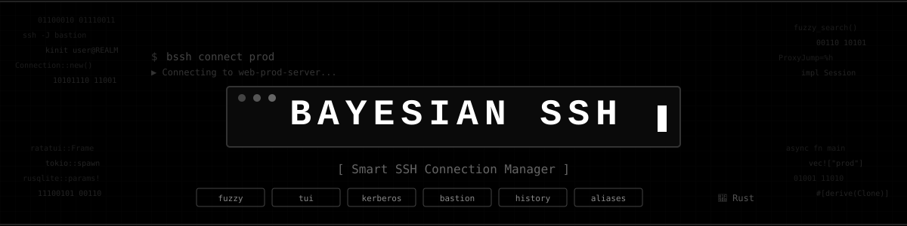

<p align="center">
  
</p>

# Bayesian SSH - Administrador de Sesiones SSH Rápido y Fácil

[](https://rustup.rs/)
[](LICENSE)
[](https://github.com/abdoufermat5/bayesian-ssh/actions/workflows/ci.yml)

> **Un administrador de sesiones SSH ultra rápido e inteligente con búsqueda con ranking bayesiano, coincidencia difusa, soporte para Kerberos, hosts bastión y gestión avanzada de historial.**

## ¿Qué es Bayesian SSH?

**Bayesian SSH** transforma tu experiencia SSH con automatización inteligente:

- **Búsqueda con ranking bayesiano** - conexiones ordenadas por frecuencia, recencia y calidad de coincidencia
- **Búsqueda difusa inteligente** en todos los comandos - encuentra conexiones por nombres parciales, etiquetas o patrones
- **Conexiones con un solo clic** a tus servidores
- **Gestión automática** de tickets Kerberos
- **Enrutamiento inteligente** de hosts bastión
- **Organización basada en etiquetas** para una gestión sencilla
- **Historial completo de conexiones** con estadísticas
- **Base de datos SQLite** para persistencia

## Inicio Rápido

### Instalación

#### Opción 1: Instalación en una Línea (Recomendada)
```bash
# Instala automáticamente la última versión del CLI (no interactivo)
curl -fsSL https://raw.githubusercontent.com/abdoufermat5/bayesian-ssh/main/install.sh | bash

# Instala automáticamente la última versión de la GUI de escritorio (no interactivo)
curl -fsSL https://raw.githubusercontent.com/abdoufermat5/bayesian-ssh/main/install.sh | bash -s -- --desktop

# Instalación interactiva (elige CLI o Escritorio)
curl -fsSL https://raw.githubusercontent.com/abdoufermat5/bayesian-ssh/main/install.sh | bash -s -- --interactive
```

#### Opción 2: Compilación Manual
```bash
# Clona y compila
git clone https://github.com/abdoufermat5/bayesian-ssh.git
cd bayesian-ssh

# Compila e instala la versión CLI usando el Makefile
make release
make install

# Compila e instala la versión GUI de escritorio usando el Makefile
make install-desktop
```

### Primera Conexión
```bash
# Agrega un servidor
bayesian-ssh add "My Server" server.company.com

# Conéctate instantáneamente
bayesian-ssh connect "My Server"
```

## 📖 Uso Básico

### Comandos Principales
```bash
# Conéctate a un servidor (con búsqueda difusa)
bayesian-ssh connect "Server Name"        # Coincidencia exacta
bayesian-ssh connect "webprod"            # Encuentra "web-prod-server"
bayesian-ssh connect "prod"               # Muestra todos los servidores de producción

# Gestiona conexiones (todos con búsqueda difusa)
bayesian-ssh edit "webprod"               # Edita la configuración de conexión
bayesian-ssh show "dbprod"                # Muestra detalles de la conexión
bayesian-ssh remove "apigateway"          # Elimina la conexión

# Agrega nueva conexión
bayesian-ssh add "Server Name" hostname.com

# Lista conexiones
bayesian-ssh list

# Importa desde la configuración de SSH
bayesian-ssh import

# Modo interactivo TUI
bayesian-ssh tui                          # Navegador de conexiones a pantalla completa

# Modo interactivo GUI de escritorio
bayesian-ssh-desktop                      # Inicia el cliente GUI de escritorio
```

### Gestión de Sesiones
```bash
# Visualiza el historial de sesiones con estadísticas
bayesian-ssh history                      # Sesiones recientes
bayesian-ssh history -c "prod"            # Filtra por conexión
bayesian-ssh history --days 7 --failed    # Fallos de la semana pasada

# Gestiona sesiones activas
bayesian-ssh close                        # Lista sesiones activas
bayesian-ssh close "Server"               # Cierra una sesión específica
bashian-ssh close --cleanup              # Limpia sesiones abandonadas
bashian-ssh close --all                  # Cierra todas las sesiones
```

### Alias de Conexión
```bash
# Crea atajos para conexiones
bayesian-ssh alias add db prod-database   # 'db' → 'prod-database'
bayesian-ssh alias add p1 Portail01       # Alias rápido
bayesian-ssh connect db                   # Usa el alias

bayesian-ssh alias list                   # Muestra todos los alias
bayesian-ssh alias remove db              # Elimina alias
```

### Gestión de Bastión
```bash
# Usa el bastión por defecto
bayesian-ssh add "Server" host.com

# Fuerza conexión directa
bayesian-ssh add "Server" host.com --no-bastion

# Bastión personalizado
bayesian-ssh add "Server" host.com --bastion custom-bastion.com
```


### Configuración

La aplicación crea automáticamente la configuración en `~/.config/bayesian-ssh/`:

```bash
# Visualiza la configuración actual
bayesian-ssh config

# Establece valores predeterminados (Kerberos está desactivado por defecto, se usa el usuario actual)
bayesian-ssh config --use-kerberos --default-user customuser
```

## Documentación

La documentación completa se construye con [mdBook](https://rust-lang.github.io/mdBook/). Para compilar y ver localmente:

```bash
make docs          # Compila en docs/book/
make docs-serve    # Sirve localmente con recarga en vivo
```

La documentación cubre:

- **[Primeros Pasos](docs/src/getting-started/installation.md)** - Instalación, inicio rápido, configuración
- **[Guía del Usuario](docs/src/user-guide/connection-management.md)** - Conexiones, sesiones, alias, TUI, hosts bastión
- **[Uso Avanzado](docs/src/advanced-usage/enterprise.md)** - Empresa, nube, CI/CD, seguridad y cumplimiento
- **[Referencia](docs/src/reference/architecture.md)** - Arquitectura, solución de problemas, registro de cambios

## Registro de Cambios
Consulta [CHANGELOG.md](CHANGELOG.md) para ver las notas detalladas de cada versión.

## Contribución

1. **Haz un Fork** del proyecto
2. **Crea** una rama de funcionalidad (`git checkout -b feature/AmazingFeature`)
3. **Commitea** tus cambios (`git commit -m 'Add AmazingFeature'`)
4. **Push** a la rama (`git push origin feature/AmazingFeature`)
5. **Abre** un Pull Request

## Licencia

Este proyecto está licenciado bajo **MIT**. Consulta el archivo [LICENSE](LICENSE) para más detalles.

---
