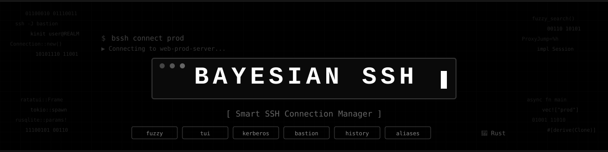

<p align="center">
  
</p>

# Bayesian SSH - Fast and Easy SSH Session Manager

[](https://rustup.rs/)
[](LICENSE)
[](https://github.com/abdoufermat5/bayesian-ssh/actions/workflows/ci.yml)

> **An ultra-fast and intelligent SSH session manager with Bayesian-ranked search, fuzzy matching, Kerberos support, bastion hosts, and advanced history management.**

## What is Bayesian SSH?

**Bayesian SSH** transforms your SSH experience with intelligent automation:

- **Bayesian-ranked search** - connections ranked by frequency, recency, and match quality
- **Intelligent fuzzy search** across all commands - find connections by partial names, tags, or patterns
- **One-click connections** to your servers
- **Automatic Kerberos** ticket management
- **Smart bastion host** routing
- **Tag-based organization** for easy management
- **Complete connection history** with statistics
- **SQLite database** for persistence

## Quick Start

### Installation

#### Option 1: One-liner Install (Recommended)
```bash
# Install full package (CLI + Desktop GUI)
curl -fsSL https://raw.githubusercontent.com/abdoufermat5/bayesian-ssh/main/install.sh | bash

# Server / Headless install (CLI only, no GUI dependencies)
curl -fsSL https://raw.githubusercontent.com/abdoufermat5/bayesian-ssh/main/install.sh | bash -s -- --no-gui

# Interactive mode
curl -fsSL https://raw.githubusercontent.com/abdoufermat5/bayesian-ssh/main/install.sh | bash -s -- --interactive
```

#### Option 2: Linux Distribution Packages (.deb / .rpm)
Download pre-built packages from [Releases](https://github.com/abdoufermat5/bayesian-ssh/releases):

```bash
# Debian / Ubuntu / Linux Mint / Pop!_OS (.deb)
sudo apt install ./bayesian-ssh_2.6.0_amd64.deb

# Fedora / RHEL / CentOS / openSUSE (.rpm)
sudo dnf install ./bayesian-ssh-2.6.0-1.x86_64.rpm
```

#### Option 3: Snap Store
```bash
sudo snap install bayesian-ssh
sudo snap connect bayesian-ssh:ssh-keys   # read-only ~/.ssh and /etc/ssh
sudo snap alias bayesian-ssh bssh         # optional short alias
```

The snap includes the CLI and the desktop app. Strict confinement means `~/.ssh`
is read-only and config lives under `~/snap/bayesian-ssh/current/`; see
[docs/src/reference/distribution.md](docs/src/reference/distribution.md#snap-store)
for the full list of limits.

#### Option 4: Build from Source
```bash
git clone https://github.com/abdoufermat5/bayesian-ssh.git
cd bayesian-ssh

# Build & install locally
make release && make install

# Package .deb and .rpm locally
make package
```

#### Verify a release
Release assets are signed. With `cosign` and the `gh` CLI installed:

```bash
cosign verify-blob --bundle SHA256SUMS.sigstore.json \
  --certificate-identity-regexp '^https://github\.com/abdoufermat5/bayesian-ssh/\.github/workflows/release\.yml@refs/(tags/v.+|heads/main)$' \
  --certificate-oidc-issuer https://token.actions.githubusercontent.com SHA256SUMS

sha256sum --ignore-missing -c SHA256SUMS

gh attestation verify bayesian-ssh-linux-x86_64.tar.gz --repo abdoufermat5/bayesian-ssh
```

`install.sh` verifies the `cosign` signature automatically when `cosign` is
installed, and always verifies `SHA256SUMS`.

#### In-app updates
The desktop `.AppImage` and the `bayesian-ssh-desktop` `.deb`/`.rpm` from the
GitHub release update themselves from **Settings → Updates**. The snap, the
`install.sh` binaries, the unified `bayesian-ssh` packages and source builds are
updated the way they were installed.

### First Connection
```bash
# Add a server
bayesian-ssh add "My Server" server.company.com

# Connect instantly
bayesian-ssh connect "My Server"
```

## 📖 Basic Usage

### Core Commands
```bash
# Connect to a server (with fuzzy search)
bayesian-ssh connect "Server Name"        # Exact match
bayesian-ssh connect "webprod"            # Finds "web-prod-server"
bayesian-ssh connect "prod"               # Shows all production servers

# Manage connections (all with fuzzy search)
bayesian-ssh edit "webprod"               # Edit connection settings
bayesian-ssh show "dbprod"                # Show connection details
bayesian-ssh remove "apigateway"          # Remove connection

# Add new connection
bayesian-ssh add "Server Name" hostname.com

# List connections
bayesian-ssh list

# Import from SSH config
bayesian-ssh import

# Interactive Desktop GUI mode
bayesian-ssh-desktop                      # Launches the desktop GUI client
```

### Session Management
```bash
# View session history with stats
bayesian-ssh history                      # Recent sessions
bayesian-ssh history -c "prod"            # Filter by connection
bayesian-ssh history --days 7 --failed    # Last week's failures

# Manage active sessions
bayesian-ssh close                        # List active sessions
bayesian-ssh close "Server"               # Close specific session
bayesian-ssh close --cleanup              # Clean stale sessions
bayesian-ssh close --all                  # Close all sessions
```

### Connection Aliases
```bash
# Create shortcuts for connections
bayesian-ssh alias add db prod-database   # 'db' → 'prod-database'
bayesian-ssh alias add p1 Portail01       # Quick alias
bayesian-ssh connect db                   # Uses alias

bayesian-ssh alias list                   # Show all aliases
bayesian-ssh alias remove db              # Remove alias
```

### Bastion Management
```bash
# Use default bastion
bayesian-ssh add "Server" host.com

# Force direct connection
bayesian-ssh add "Server" host.com --no-bastion

# Custom bastion
bayesian-ssh add "Server" host.com --bastion custom-bastion.com
```


### Configuration

The app automatically creates configuration in `~/.config/bayesian-ssh/`:

```bash
# View current config
bayesian-ssh config

# Set defaults (Kerberos is disabled by default, current user is used)
bayesian-ssh config --use-kerberos --default-user customuser
```

## Documentation

Full documentation is built with [mdBook](https://rust-lang.github.io/mdBook/). To build and view locally:

```bash
make docs          # Build to docs/book/
make docs-serve    # Serve locally with live reload
```

Documentation covers:

- **[Getting Started](docs/src/getting-started/installation.md)** - Installation, quick start, configuration
- **[User Guide](docs/src/user-guide/connection-management.md)** - Connections, sessions, aliases, desktop GUI, bastion hosts
- **[Advanced Usage](docs/src/advanced-usage/enterprise.md)** - Enterprise, cloud, CI/CD, security & compliance
- **[Reference](docs/src/reference/architecture.md)** - Architecture, troubleshooting, changelog

## Changelog
See [CHANGELOG.md](CHANGELOG.md) for detailed release notes.

##  Contributing

1. **Fork** the project
2. **Create** a feature branch (`git checkout -b feature/AmazingFeature`)
3. **Commit** your changes (`git commit -m 'Add AmazingFeature'`)
4. **Push** to the branch (`git push origin feature/AmazingFeature`)
5. **Open** a Pull Request

##  License

This project is licensed under **MIT**. See the [LICENSE](LICENSE) file for details.

---
