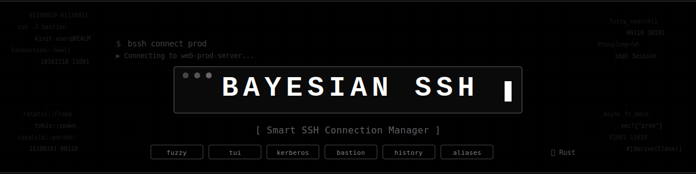

# Bayesian SSH

  

> **An ultra-fast and intelligent SSH session manager with Bayesian-ranked search, fuzzy matching, Kerberos support, bastion hosts, and advanced history management.**

## What is Bayesian SSH?

**Bayesian SSH** transforms your SSH experience with intelligent automation:

- **Bayesian-ranked search** - connections ranked by frequency, recency, and match quality
- **Intelligent fuzzy search** across all commands - find connections by partial names, tags, or patterns
- **One-click connections** to your servers
- **Automatic Kerberos** ticket management
- **Smart bastion host** routing
- **Tag-based organization** for easy management
- **Complete connection history** with statistics
- **SQLite database** for persistence
- **Full-screen TUI** for browsing and managing connections

## Documentation Overview

This documentation is organized into the following sections:

- **[Getting Started](./getting-started/installation.md)** - Installation, quick start, and initial configuration
- **[User Guide](./user-guide/connection-management.md)** - Day-to-day usage and features
- **[Advanced Usage](./advanced-usage/enterprise.md)** - Enterprise environments, cloud infrastructure, and complex scenarios
- **[Reference](./reference/architecture.md)** - Technical architecture, troubleshooting, and changelog
