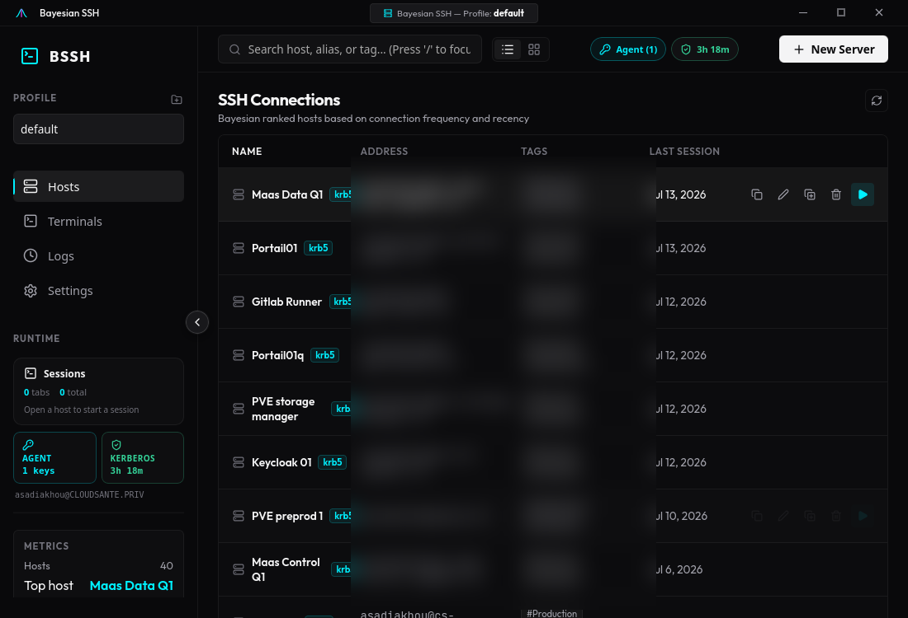
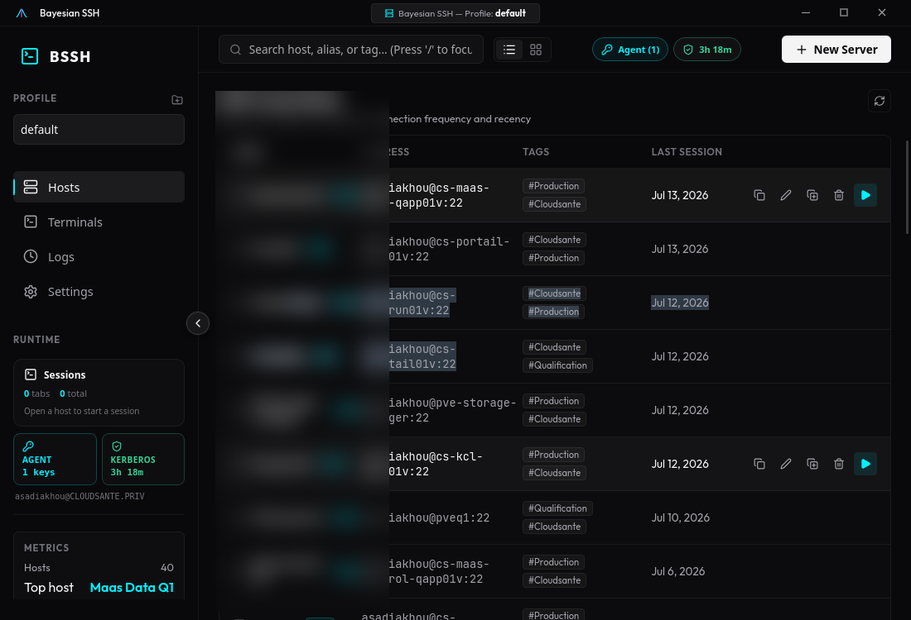
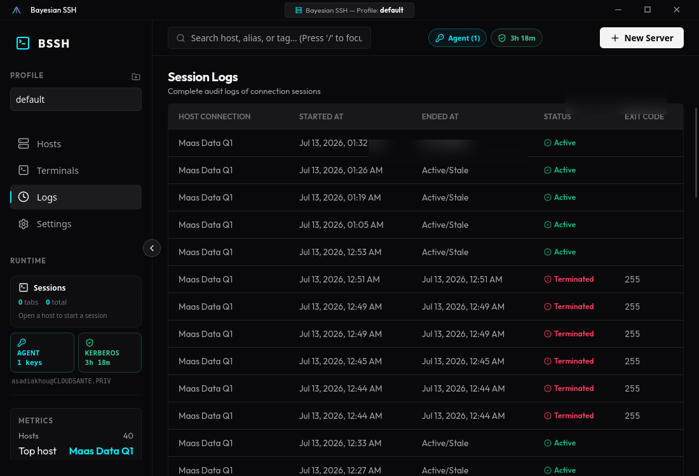

# Desktop GUI Mode

Bayesian SSH features a premium, standalone desktop client built on SvelteKit, TypeScript, and Rust/Tauri. It is designed to fit seamlessly into standard developer workflows with high aesthetic fidelity and visual design inspired by modern developer platforms like Vercel and VS Code.

To launch the desktop GUI app:

```bash
bayesian-ssh-desktop
```



---

## Workspace Navigation

The GUI client is divided into a three-pane layout:
1. **Window Titlebar**: A custom drag-supported titlebar showing the active Profile environment, window controls, and host information.
2. **Left Navigation Sidebar**: Contains quick access tabs, active environment/profile selector, quick tag filters, and SSH Agent status check.
3. **Main Viewport**: Displays the content of the active tab.

---

## Tabs

### 1. Hosts (Connections)
Browse and search saved connection profiles using a live search input.
- **View Modes**: Toggle between **List View** (linear row layout with column metadata) and **Grid View** (modern visual cards layout).
- **Interactive Rows/Cards**:
  - **Double-click** any host row or card to spawn an interactive SSH terminal.
  - **Copy SSH Command**: Instantly copy the raw terminal SSH command to the system clipboard.
  - **Duplicate Connection**: Clone a host configuration. Upon duplication, the new clone flashes briefly in cyan, is highlighted, and immediately slides open the Edit drawer to update hostname, ports, or credentials.
  - **Edit Connection**: Slide over a side drawer containing form fields for Hostname/IP, Port, User, SSH Private Key path, Bastion Jump host, Kerberos/GSSAPI options, and Tags.
  - **Delete Connection**: Opens a premium, in-app delete modal showing the exact username/host details to prevent accidental deletions.

### 2. Terminals
Spawns interactive terminal viewports powered by Xterm.js and a dedicated Rust PTY session manager backend.



- **Multi-host Split View**: Spawns a dedicated left **Quick Connect** sidebar displaying all saved hosts. Click any host in the sidebar to spawn a new interactive tab concurrently next to existing ones, without losing previous sessions.
- **Popout Terminals**: Move active terminal tabs out of the main desktop app window into standalone windows. Supported via full drag-and-drop/reattachment workflows.
- **PTY Session Isolation**: Each session runs its own isolated background process loop. Closing one session cleanly disposes of its subprocess without affecting other active connections.

### 3. Logs (History)
An audit table displaying complete connection metrics:
- Connection Hostname and environment name.
- Session start and end timestamps.
- Reachability status (Active/Closed/Failed).
- Exit codes returned from the shell or SSH connection.

### 5. Settings
Adjust preferences for the desktop environment:



- **Appearance Theme**: Select from Zinc (Slate Minimalist), Cyberpunk Neon, OLED Pitch Black, or Slate (Sleek Navy).
- **Fuzzy Search Scoring**: Adjust reachability weight vs pattern matches.
- **SSH Agent Integration**:
  - Auto-start SSH agent on app launch.
  - Custom SSH agent socket path (pre-filled with the active shell's `$SSH_AUTH_SOCK` value by default).
- **Connection Defaults**:
  - Global Default SSH User.
  - Global Default SSH Port.
  - Global Default Identity File (SSH private key path).

---

## Modals & Drawers

The GUI avoids ugly OS native alerts and prompts, substituting them with bespoke animations:
- **Delete Confirmation Modal**: Center-aligned dark-themed overlay showing warning labels, danger icon ring with a pulsing visual glow, and confirmation controls.
- **SSH Agent Keys Manager**: Lists loaded SSH keys present in the current socket's keyring and enables quick-addition of identity file keys.
- **Environments Manager**: Add, delete, and switch configuration profiles.
