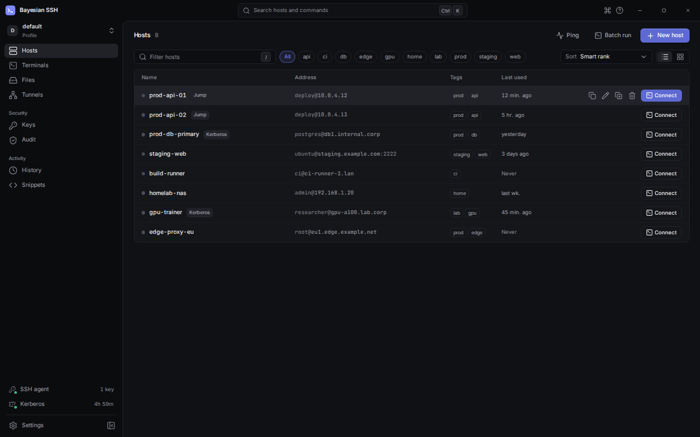
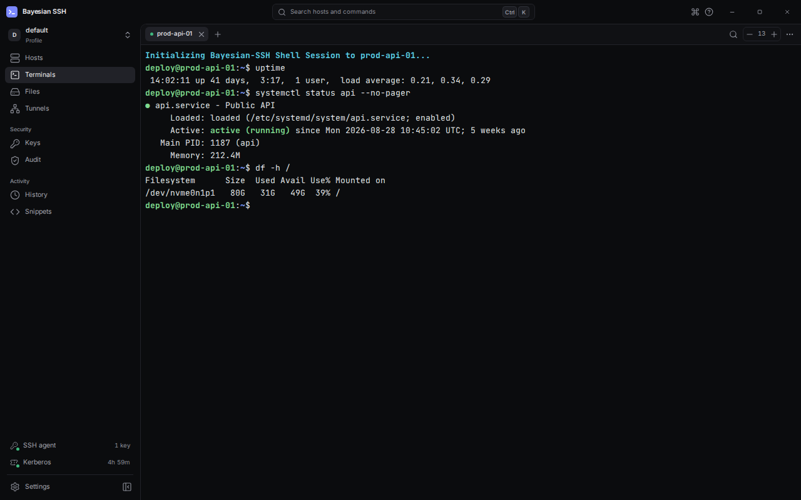
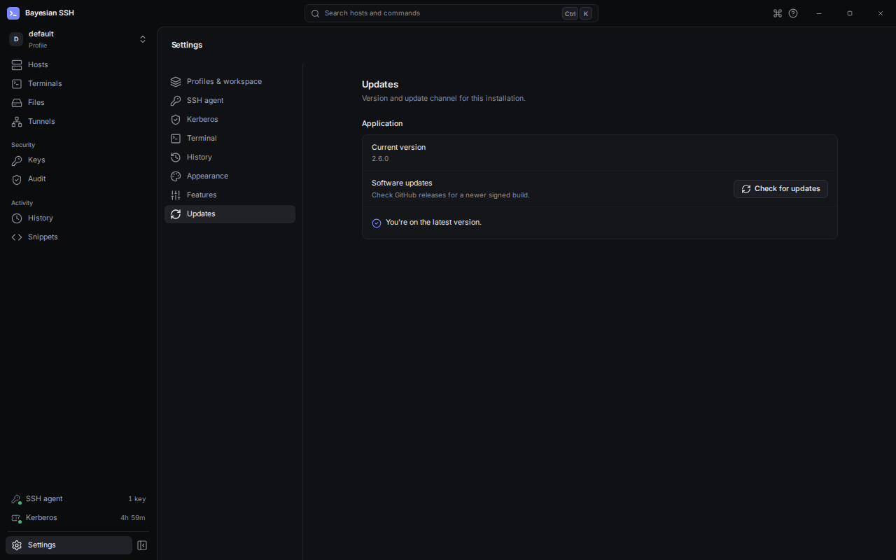

# Desktop GUI Mode

Bayesian SSH ships a standalone desktop app: a SvelteKit/TypeScript front end on a
Rust/Tauri backend. It manages the same hosts, profiles and session history as the
CLI, and adds terminals, a file browser, tunnel rules and a security audit.

## Launching

```bash
bssh desktop
bayesian-ssh desktop
```

`desktop` (alias `gui`) starts the GUI detached in the background and returns the
prompt immediately. The launcher looks for the `bayesian-ssh-gui` binary next to the
CLI executable, then in `PATH`.

Packaged installs start the same `bayesian-ssh-gui` binary:

- the `.deb`, `.rpm` and AppImage bundles are built under the `bayesian-ssh-desktop`
  product name; the `.deb` and `.rpm` add an entry to the application menu;
- in the snap, the `bayesian-ssh.gui` app runs the desktop binary and is also
  available from the app menu.

The first launch runs onboarding: profile name and connection defaults, an optional
openSSH import, the theme, and an optional restore from a backup file.

## Window layout

- **Title bar** — app name, a command search button (`Search hosts and commands`,
  `Ctrl`/`Cmd` + `K`), a keyboard-shortcuts button, an About button and the window
  controls. The bar is draggable.
- **Sidebar** — a profile switcher at the top, grouped navigation, status entries at
  the bottom, and a collapse toggle.
- **Main area** — the active view, each with a single header holding its title and
  one primary action.

Sidebar navigation:

- **Hosts**, **Terminals**, **Files**, **Tunnels** (Files and Tunnels appear only
  when they are enabled under Settings → Features)
- **Security**: Keys, Audit
- **Activity**: History, Snippets
- At the bottom: **Background** (only while sessions run outside the tab bar), the
  **SSH agent** entry (state plus loaded-key count; click to start the agent or open
  its manager), the **Kerberos** entry, and **Settings**. The Kerberos entry stays
  hidden until a connection actually uses Kerberos.

The sidebar collapses automatically when the window is narrower than 860 px.

## Views

### Hosts



The host list is the main view. It has a filter box, tag chips, a sort selector and a
list/grid toggle.

- **Sort** — Smart rank (frequency and recency), Last used, Name or Address.
- **List view** — columns Name, Address, Tags and Last used. Address is shown as
  `user@host`, with `:port` when it is not 22. Hosts with Kerberos or a jump host
  carry a badge.
- **Grid view** — the same information as cards, mounted progressively while you
  scroll. The list is windowed, so large host lists stay responsive.
- **Ping** — checks reachability for every host, then reports `n/m up` and shows a
  latency next to each reachable host.
- **Batch run** — opens the batch-execution modal (see below).
- **New host** — opens the host form.

Row actions (also on cards): **Connect**, **Copy SSH command**, **Edit**,
**Duplicate** and **Delete**. Duplicate creates `<name> (Copy)`, flashes the new row
and opens it for editing. Delete asks for confirmation and shows `user@host:port`.

Keyboard: `↑`/`↓` or `j`/`k` move the selection, `Enter` connects, `Ctrl`/`Cmd` + `E`
edits the selected host. With no hosts yet, the empty state offers
**Import ~/.ssh/config** and **New host**.

The host form (`New host` / `Edit host`) collects Name, Host, Port, User and an
identity file, plus a Kerberos switch, comma-separated tags and an **Advanced**
section for a jump host and jump user. Changes apply to new sessions; saved hosts are
written to the active profile.

### Terminals



Terminals open as tabs over xterm.js sessions backed by Rust PTY processes. The empty
state lists your recent hosts to connect with, and the **+** button opens a host
launcher with a `Connect to host…` filter.

Each tab shows a status dot (Connected, Connecting, Failed to connect, Disconnected)
and a close button; middle-clicking a tab closes it. With an active session:

- **Find** (`Ctrl`/`Cmd` + `F`) opens a per-tab search bar over the scrollback
  (`Enter` next match, `Shift` + `Enter` previous).
- **Font size** buttons adjust the terminal text; `Ctrl`/`Cmd` + mouse wheel zooms,
  and `Ctrl`/`Cmd` + `+`/`-`/`0` adjust or reset it when the terminal is not focused.
  The value is remembered in settings.
- **More** offers Open in new window, Run in background, Export scrollback (to a
  `.txt` file), Clear screen, Manage sessions…, and Close all sessions.

Sessions can live in three places: a tab, a pop-out window, or the background.
Dragging a tab away from the tab strip opens it in its own window; dragging a pop-out
or background session back onto the tab bar docks or reattaches it with its buffered
output. The **Running sessions** manager lists everything outside the tab bar and can
focus, dock, reattach or terminate each session, or terminate all of them.

Closing the window while sessions are open shows a confirmation with **Cancel**,
**Minimize to tray** (keeps the sessions running) and **Disconnect and quit**. With no
open sessions the window simply hides to the tray.

Terminal copy/paste uses the usual key combinations (`Ctrl`/`Cmd` + `C` for a
selection, `Ctrl`/`Shift` + `C`, `Ctrl`/`Cmd` + `V`, `Ctrl`/`Shift` + `V` or
`Shift` + `Insert`). OSC 52 clipboard writes from remote hosts are honoured; reads are
refused.

### Files

The Files view browses a remote directory over SFTP. Pick a host and press
**Connect**; the header then shows `user@host` and the button becomes **Disconnect**.

- Breadcrumbs navigate the tree; a go-to button turns the path into an editable field
  (`Enter` loads, `Esc` cancels).
- **Parent directory** and **Refresh** buttons sit in the toolbar, next to quick
  bookmarks for `/`, `~`, `/var/www`, `/etc`, `/var/log` and `/tmp`.
- The filter matches a file name or its permissions, and a **Hidden files** toggle
  shows or hides dotfiles (with a count of what is hidden).
- List and grid layouts are available; each entry shows its type icon, size,
  permissions and modification time, and its remote path can be copied.

The browser is read-only: it lists directories and reports errors, but it does not
upload or download files.

### Tunnels

The Tunnels view manages port-forwarding rules: local (`-L`), remote (`-R`) and
SOCKS5 dynamic (`-D`). You can start from a preset or add a rule with a host, type,
local port, remote host and remote port; the form validates the values and previews
the matching `ssh` command. Each rule can be enabled or disabled, edited, deleted, or
have its local address copied.

Rules are configuration held by the view: no tunnel process is started, and rules are
not persisted across restarts. The section is hidden when Tunnels is turned off under
Settings → Features.

### Keys

The Keys view lists the identity files in `~/.ssh`, paired from each `*.pub` file:

- columns **Key** (name, comment and shortened path), **Type**, **Fingerprint**
  (copyable) and **Permissions**;
- a green permissions badge means the private key is only readable by you; a red
  badge means group/other bits are set, and an alert at the top gives a copyable
  `chmod 600` command for every affected key;
- **Generate key** creates a new pair in `~/.ssh` (Ed25519, or RSA for older servers)
  with an empty passphrase;
- **Deploy** copies a public key to a chosen host's `authorized_keys`.

### Security audit

The audit view runs on open and scores the local setup out of 100 with a grade, plus
counts for Critical, Warnings and Info findings. A severity filter narrows the list.
Each finding shows its description and a copyable remediation command.

The checks cover StrictHostKeyChecking being disabled, overly permissive permissions
on the config directory and database file, private keys readable by other users,
connections with no identity key and no Kerberos, and connections unused for more than
90 days. **Fix permissions** tightens the config directory, database file, `~/.ssh`
and key files that are group/other-accessible, then re-runs the audit. **Re-scan**
re-runs it manually.

### History

Session history is grouped by day (Today, Yesterday, then dates) and shows Host,
Started (relative, with an absolute tooltip in the configured timezone), Duration,
Status and Exit code. Rows are badged **Succeeded**, **Failed** or **Running**; the
status chips (`All`, `Succeeded`, `Failed`) and the search box filter the table.
**Export CSV** downloads every recorded session.

### Settings

Settings has its own sidebar of sections. Every control saves immediately; there is no
Save button.

- **Profiles & workspace** — switch or manage profiles, choose how hosts are ranked
  (usage-ranked Bayesian scoring or fuzzy matching), set the OpenSSH config file used
  for imports, import hosts, encrypt/export/restore backups, and see the config,
  profile and database paths.
- **SSH agent** — start the agent on launch, point at a custom agent socket, and set
  the default user and port used by hosts that don't define their own.
- **Kerberos** — monitor ticket expiry and set the warning threshold in minutes.
- **Terminal** — font family, size and line height, cursor style and blinking,
  scrollback size, copy-on-select, snippet confirmation, and whether the file browser
  lists dotfiles.
- **History** — record session history, cap the number of stored entries, and set the
  backend log level.
- **Appearance** — pick a theme and the timezone used for dates in history, logs and
  audit. Themes: **Graphite**, **Midnight**, **OLED black** and **Slate**.
- **Features** — turn the SFTP file browser and the Tunnels section on or off; the
  sidebar updates immediately.
- **Updates** — shows the current version and handles updates for the way the app was
  installed.

  

  In-app updates apply to the AppImage and to the `bayesian-ssh-desktop` `.deb`/`.rpm`
  from GitHub releases: **Check for updates** reports a newer signed build, and
  **Install and restart** downloads, verifies and installs it. Open terminal sessions
  are closed and the app restarts. Snap installs are updated by the Snap Store (the
  section shows `sudo snap refresh bayesian-ssh`), and other installs (raw binaries
  from `install.sh` or release tarballs, the unified CLI+GUI packages, and source
  builds) are updated the way they were installed.

## Modals and dialogs

- **Command palette** (`Ctrl`/`Cmd` + `K`) — searches hosts and commands. It groups
  results into Hosts, Actions, Navigation and Themes; with an empty query it shows the
  first hosts plus the actions and navigation entries. Host entries connect on
  selection; actions cover New host, Run command on hosts, Ping all hosts, Manage
  sessions and Fix key permissions; navigation entries jump to a view; theme entries
  switch the theme.
- **Batch run** — runs one command on several hosts in parallel. Pick hosts (with
  filter, tag chips and All/None/Invert/Prod/Non-prod shortcuts), enter a command,
  optionally save it as a template, choose dry run and a timeout, then preview or run.
  Results list each host with its exit code, duration and stdout/stderr, and can be
  exported as Markdown, CSV, JSON or plain text. A History tab keeps recent runs (for
  inspection or repeat) and a Templates tab manages built-in and custom commands.
  `Ctrl`/`Cmd` + `Enter` runs, `Ctrl`/`Cmd` + `Shift` + `D` toggles dry run.
- **Snippets** — saved commands with a title, category, description and command. Search
  and category chips narrow the list; snippets can be created, edited, deleted, copied,
  or sent to the active terminal tab (**Run in terminal**, which asks for confirmation
  unless that is disabled in settings; with no active terminal the command is copied
  instead).
- **Profiles** — list profiles, create a new one, and delete any profile that is
  neither active nor the default. Switching profiles happens from the sidebar profile
  menu, which also opens this dialog through **Manage profiles…**.
- **SSH agent** — shows the agent socket and the loaded keys with their fingerprints,
  and adds a private key file to the agent.
- **Kerberos** — shows ticket status (principal, realm, remaining lifetime, renew
  time, cache and config paths) and acquires a ticket with `kinit`, or renews the
  existing one (`kinit -R`, with an optional password). Ticket options cover
  forwardable, proxiable, lifetime and renewal lifetime.
- **About** — version, active profile, config and database paths, license, and links to
  the source code, release notes and issue tracker.
- **Confirmations** — host deletion, all-session close, and quitting with open sessions
  all use in-app dialogs instead of native prompts.

## Keyboard shortcuts

Press `?`, `F1` or `Ctrl`/`Cmd` + `/` to open the shortcut sheet. Single-key shortcuts
work when no text field is focused.

| Action | Keys |
| --- | --- |
| Command palette | `Ctrl`/`Cmd` + `K` |
| Keyboard shortcuts | `?`, `F1`, `Ctrl`/`Cmd` + `/` |
| Close a dialog or clear the filter | `Esc` |
| Hosts / Terminals / Keys / Audit / History / Settings | `1` / `2` / `3` / `4` / `5` / `6` |
| Focus the host filter | `/` |
| New host | `N`, `Ctrl`/`Cmd` + `N` |
| Move host selection | `↑`/`↓`, `j`/`k` |
| Connect to the selected host | `Enter` |
| Edit the selected host | `Ctrl`/`Cmd` + `E` |
| Terminal font size (when the terminal is not focused) | `Ctrl`/`Cmd` + `+` / `-` / `0` |
